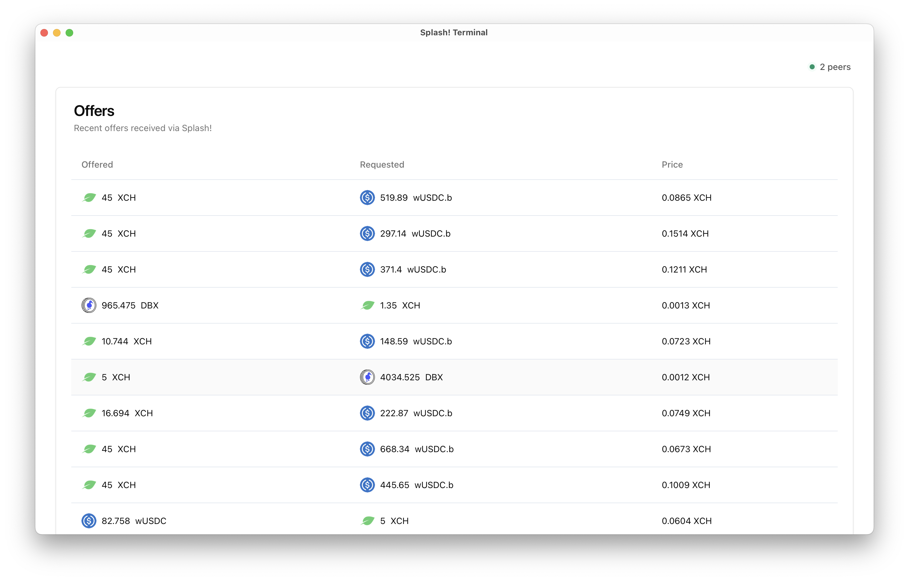

# Splash Terminal

Splash Terminal is a desktop application built with Tauri, React, and TypeScript. It provides a user interface for interacting with the Chia blockchain and the Splash! network, specifically for receiving and submitting offers.



## Features

- View and inspect Chia offers
- Submit new offers to the Splash! network
- Real-time peer connection status
- Dark mode support
- Decentralized offer sharing across the Chia ecosystem
- DHT peer discovery using libp2p

## Prerequisites

Before you begin, ensure you have the following installed:

- Node.js (v20 or later)
- Rust (latest stable version)
- pnpm (for package management)

## Getting Started

1. Clone the repository:

   ```
   git clone https://github.com/yourusername/splash-terminal.git
   cd splash-terminal
   ```

2. Install dependencies:

   ```
   pnpm install
   ```

3. Run the development server:
   ```
   pnpm tauri dev
   ```

This will start the Tauri development environment, which includes both the frontend React application and the Rust backend.

## Building for Production

To build the application for production, run:

```
pnpm tauri build
```

This will create platform-specific binaries in the `src-tauri/target/release` directory.

## Contributing

Contributions are welcome! Please feel free to submit a Pull Request.

## License

Licensed under the Apache License, Version 2.0.

This project is based on the [Splash!](https://github.com/dexie-space/splash) project, which provides the underlying decentralized network for sharing Chia offers.

Some code in `src-tauri/src` is taken from splash and is licensed under the MIT license.
